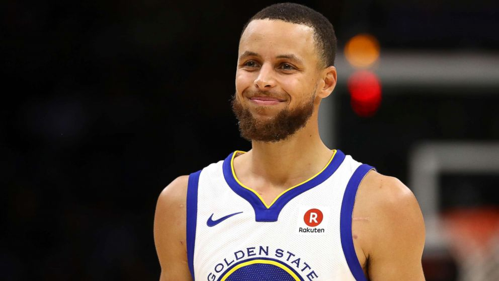

Report
================
Yeqing Chen
March 13, 2019


``` r
library(dplyr)
```

    ## Warning: package 'dplyr' was built under R version 3.4.4

    ## 
    ## Attaching package: 'dplyr'

    ## The following objects are masked from 'package:stats':
    ## 
    ##     filter, lag

    ## The following objects are masked from 'package:base':
    ## 
    ##     intersect, setdiff, setequal, union

Effective Shooting Percentage
=============================

2PT Effective Shooting % by Player
----------------------------------

``` r
shot_data <- read.csv("../data/shot-data.csv")

x1 <- shot_data %>% select(name,shot_type,shot_made_flag) %>% filter(shot_type == "2PT Field Goal")

x2 <- x1 %>% group_by(name) %>% summarise(totel_two = sum(length(shot_type)))

x3 <- x1 %>% select(name,shot_made_flag) %>% filter(shot_made_flag == "shot_yes")

x4 <- x3 %>% group_by(name) %>% summarise(made_two = sum(length(shot_made_flag)))

x5 <- merge(x2,x4,by = "name")

x6 <- mutate(x5, perc_made_two = x5$made_two/x5$totel_two)

x7 <- arrange(x6 , desc(perc_made_two))

x7
```

    ##             name totel_two made_two perc_made_two
    ## 1 Andre Iguodala       210      134     0.6380952
    ## 2   Kevin Durant       643      390     0.6065319
    ## 3  Stephen Curry       563      304     0.5399645
    ## 4  Klay Thompson       640      329     0.5140625
    ## 5 Graymond Green       346      171     0.4942197

3PT Effective Shooting % by Player
----------------------------------

``` r
y1 <- shot_data %>% select(name,shot_type,shot_made_flag) %>% filter(shot_type == "3PT Field Goal")

y2 <- y1 %>% group_by(name) %>% summarise(totel_three = sum(length(shot_type)))

y3 <- y1 %>% select(name,shot_made_flag) %>% filter(shot_made_flag == "shot_yes")

y4 <- y3 %>% group_by(name) %>% summarise(made_three = sum(length(shot_made_flag)))

y5 <- merge(y2,y4,by = "name")

y6 <- mutate(y5, perc_made_three = y5$made_three/y5$totel_three)

y7 <- arrange(y6 , desc(perc_made_three))

y7
```

    ##             name totel_three made_three perc_made_three
    ## 1  Klay Thompson         580        246       0.4241379
    ## 2  Stephen Curry         687        280       0.4075691
    ## 3   Kevin Durant         272        105       0.3860294
    ## 4 Andre Iguodala         161         58       0.3602484
    ## 5 Graymond Green         232         74       0.3189655

Effective Shooting % by Player
------------------------------

``` r
z1 <- shot_data %>% select(name,shot_type,shot_made_flag)

z2 <- z1 %>% group_by(name) %>% summarise(totel = sum(length(shot_type)))

z3 <- z1 %>% select(name,shot_made_flag) %>% filter(shot_made_flag == "shot_yes")

z4 <- z3 %>% group_by(name) %>% summarise(made = sum(length(shot_made_flag)))

z5 <- merge(z2,z4,by = "name")

z6 <- mutate(z5, perc_made = z5$made/z5$totel)

z7 <- arrange(z6 , desc(perc_made))

z7
```

    ##             name totel made perc_made
    ## 1   Kevin Durant   915  495 0.5409836
    ## 2 Andre Iguodala   371  192 0.5175202
    ## 3  Klay Thompson  1220  575 0.4713115
    ## 4  Stephen Curry  1250  584 0.4672000
    ## 5 Graymond Green   578  245 0.4238754

Narrative
=========

------------------------------------------------------------------------

Golden State Warriors' shooting analysis
========================================


The Golden State Warriors are an American professional basketball team based in Oakland, California. The Warriors compete in the National Basketball Association(NBA), as a member of the league's Western Conference Pacific Division. Founded in 1946 in Philadelphia, the Warriors relocated to the San Francisco Bay Area in 1962 and took the city's name, before changing its geographic moniker to Golden State in 1971. They play their home games at the Oracle Arena.

Around the league, the Golden State Warriors are perhaps known best for their amazing shooting. Their starting backcourt, dubbed the "Splash Brothers," features Stephen Curry, probably the best shooter of all time, and Klay Thompson, who is not far behind. This data analysis the shooting performance of five Golden State Warriors: Kevin Durant, Andre Iguodala, Klay Thompson, Stephen Curry, and Draymond Green.

-   Kevin Durant


Kevin Wayne Durant (born September 29, 1988) is an American professional basketballplayer for the Golden State Warriors of the National Basketball Association (NBA). He played one season of college basketball for the University of Texas, and was selected as the second overall pick by the Seattle SuperSonics in the 2007 NBA draft. He played nine seasons in Oklahoma City before signing with Golden State in 2016, winning back-to-back championships in 2017 and 2018 (Wikipedia).

Kevin Durant has good performance in 2016 season. In 2016 season, he total shot 915 times, and get 54% effective shooting rate. He has the highest total effective rate among other players. Meanwhile, his 3 points effective shooting rate is 38% for 272 shots and 2 points effective shooting rate is 61% for 643 shots.

-   Andre Iguodala


Andre Tyler Iguodala (born January 28, 1984) is an American professional basketball player for the Golden State Warriors of the National Basketball Association (NBA). The swingman was an NBA All-Star in 2012 and has been named to the NBA All-Defensive Team twice. Iguodala won an NBA championship with the Warriors in 2015, when he was named the NBA Finals Most Valuable Player. Iguodala helped the Warriors win two more championships in 2017 and 2018. He was also a member of the United States national team at the 2010 FIBA World Championshipand 2012 Summer Olympics, winning the gold medal both times (Wikipedia).

Andre Iguodala also has good performance in 2016 season. In 2016 season, he total shot 371 times, and get 52% effective shooting rate. Meanwhile, his 3 points effective shooting rate is 36% for 161 shots and 2 points effective shooting rate is 64% for 210 shots. Andre Iguodala has the highest 2 points effective rate than others.

-   Klay Thompson


Klay Alexander Thompson (born February 8, 1990) is an American professional basketball player for the Golden State Warriors of the National Basketball Association(NBA). He is credited as one of the greatest shooters in NBA history. He is a five-time NBA All-Star, a two-time All-NBA Third Team honoree, and a three-time NBA champion (Wikipedia).

Klay Thompson is one of best shooters of the GSW in 2016 season. In 2016 season, he total shot 1220 times, and get 47% effective shooting rate. Meanwhile, his 3 points effective shooting rate is 42% for 580 shots and 2 points effective shooting rate is 51% for 640 shots. Klay Thompson has the highest 3 points effective rate than others and second highest shot times.

-   Stephen Curry



Wardell Stephen Curry II (born March 14, 1988) is an American professional basketball player for the Golden State Warriors of the National Basketball Association (NBA). A six-time NBA All-Star, he has been named the NBA Most Valuable Player (MVP) twice and won three NBA championships with the Warriors. Many players and analysts have called him the greatest shooter in NBA history. He is credited with revolutionizing the game of basketball by inspiring teams to regularly employ the three-point shot as part of their winning strategy (Wikipedia).

Stephen Curry is also one of best shooters of the GSW in 2016 season. In 2016 season, he total shot 1250 times, and get 47% effective shooting rate. Meanwhile, his 3 points effective shooting rate is 40% for 687 shots and 2 points effective shooting rate is 54% for 563 shots. Stephen Curry has the highest shot times than others and second 3 points effective rate.

-   Draymond Green


Draymond Jamal Green Sr. (born March 4, 1990) is an American professional basketball player for the Golden State Warriors of the National Basketball Association(NBA). Green, who plays primarily at the power forward position, is a three-time NBA champion and a three-time NBA All-Star. In 2017, he won the NBA Defensive Player of the Year (Wikipedia).

Draymond Green has good performance in 2016 season. In 2016 season, he total shot 578 times, and get 42% effective shooting rate. Meanwhile, his 3 points effective shooting rate is 32% for 232 shots and 2 points effective shooting rate is 49% for 346 shots.

Depend on the shooting effective data. We can find that all five Golden State warriors are outstanding two-point shooters. Since either the number of shoots or the effective shooting rate, these Golden State Warriors all have outstanding performance. They have at least 50% effective shooting percentage, and over hundreds shoots. Among them, Curry, Thompson and Durant did particularly well. They are fairly consistent and shoot many times.

However, beyond Curry, Thompson and Durant, the Warriors simply didn't have many three-point shooters. The only other player who shoots above the league average of 35.8% is Andre Iguodala, who is still fairly inconsistent and doesn't shoot very many threes anyways. Thus, the Golden State Warriors invested in shooting even they already boast three of the greatest shooters of all time. NBA is an intensely competitive place. No one can promise he can stand on the first position forever. The Golden State Warriors still have many spaces to improve. Right now, their purpose is to train more great shooters. In the total shoots data, beyond Curry, Thompson and Durant, Andre Iguodala and Graymond Green doesn't shoot very many times. Draymond Green and Andre Iguodala's shot times are fall behind other players. They have a lot of space to improve.

In general, the Golden State Warriors is one of the best team in NBA league. The five player, Kevin Durant, Andre Iguodala, Klay Thompson, Stephen Curry, and Draymond Green, all have outstanding performance in season 2016.
