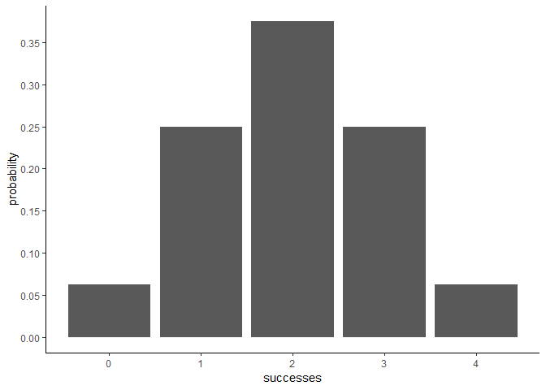
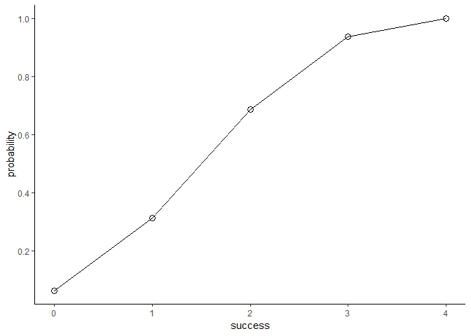

<!-- README.md is generated from README.Rmd. Please edit that file -->
Introduction to binomial
========================

The Binomial distribution is perhaps the most famous probability distribution among discrete random variables. This is the theoretical probability model that we use when calculating probabilities about the number of successes in a fixed number of random trials performed under identical conditions (assuming a constant probability of success on each trial).

The formula of the binomial probability:

*P*<sub>*r*</sub>(*X* = *k*)=(**<sub>*k*</sub><sup>*n*</sup>)*p*<sup>*k*</sup>(1 − *p*)<sup>*n* − *k*</sup>

where: - n is the number of (fixed) trials (*n* ≥ 0)

-   p is the probability of success on each trial (0 ≤ *p* ≤ 1)

-   1-p is the probability of failure on each trial

-   k is a variable that represents the number of successes out of n trials (0 ≤ *k* ≤ *n*)

-   the first term in parenthesis is NOT a fraction, it is the number of combinations in which k success can occur in n trials

This document introduces you to binomial's basic set of tools, and shows you how to apply them to calculate binomial distribution.

Overview
--------

`"binomial"` is a minimal [R](http://www.r-project.org/) package that provides functions to simulate calculating binomial distribution.

-   `bin_choose()` Calculates the number of combinations in which k successes can occur in n trials.
-   `bin_probability()` Calculates the probability in whick k successes can occur in n trials with a constant probability of success on each trial.
-   `bin_distribution()` obtain a data with the probability distribution, producing a `"dis"` object.
-   `plot()` method for a `"dis"` object to plot the histogram of the probability distribution.
-   `bin_cumulative()` obtain a data with the cumulative probability distribution, producing a `"cum"` object.
-   `plot()` method for a `"cum"` object to Plot the cumulative probability distribution.
-   `bin_variable()` list with named elements for binomial variables, producing a `"bin"` object.
-   `summary()` method for a `"bin"` object, listing with named elements and summary for binomial variables
-   `bin_mean()` The expected value or mean of a binomial distribution.
-   `bin_variance()` The variance of a binomial distribution.
-   `bin_mode()` The most likely number of a binomial distribution distribution.
-   `bin_skewness()` Skewness is a measure of the asymmetry of the probability distribution of a random variable about its mean.
-   `bin_kurtosis()` The Kurtosis is a measure of the "tailedness" of the probability distribution of a random variable.

Motivation
----------

This package has been developed to illustrate some of the concepts behind the creation of an R package.

Installation
------------

Install the development version from GitHub via the package `"devtools"`:

``` r
# development version from GitHub:
#install.packages("devtools") 
# install "binomial" (without vignettes)
devtools::install_github("stat133-sp19/hw-stat133-yeqing0092/workout03/binomial")
# install "binomial" (with vignettes)
devtools::install_github("stat133-sp19/hw-stat133-yeqing0092/workout03/binomial", build_vignettes = TRUE)
```

Usage
-----

``` r
library(binomial)
# Finding the number of combination in getting 3 heads in 4 tosses.
bin_choose(n=4,k=3)
#> [1] 4

# Calculates the probability of getting 3 heads in 4 tosses of a fair coin.
bin_probability(success = 3,trials = 4,prob = 0.5)
#> [1] 0.25

# the probability distribution for 4 tosses of a fair coin
dis1 <- bin_distribution(trials = 4, prob = 0.5)
dis1
#>   success probability
#> 1       0      0.0625
#> 2       1      0.2500
#> 3       2      0.3750
#> 4       3      0.2500
#> 5       4      0.0625

# Plot
plot(dis1)
#> Warning: package 'ggplot2' was built under R version 3.4.4
```



``` r

# The cumulative probability distribution for 4 tosses of a fair coin.
dis2 <- bin_cumulative(4,0.5)
dis2
#>   success probability cumulative
#> 1       0      0.0625     0.0625
#> 2       1      0.2500     0.3125
#> 3       2      0.3750     0.6875
#> 4       3      0.2500     0.9375
#> 5       4      0.0625     1.0000

# Plot
plot(dis2)
```



``` r

# list with named elements binomial distribution for 4 tosses of a fair coin
bin1 <- bin_variable(trials = 4, prob = 0.5)
bin1
#> "Binomial variable"
#> 
#> Parameters
#> - number of trials: 4 
#> - prob of success : 0.5

# summary
binsum1 <- summary(bin1)
binsum1
#> "Summary Binomial"
#> 
#> Parameters
#> - number of trials: 4 
#> - prob of success : 0.5 
#> 
#> Measures
#> - mean    : 2 
#> - variance: 1 
#> - mode    : 2 
#> - skewness: 0 
#> - kurtosis: -0.5


#mean
bin_mean(4,0.5)
#> [1] 2

#variance
bin_variance(4, 0.5)
#> [1] 1

#mode
bin_mode(4, 0.5)
#> [1] 2

#skewness
bin_skewness(4, 0.5)
#> [1] 0

#kurtosis
bin_kurtosis(4, 0.5)
#> [1] -0.5
```
